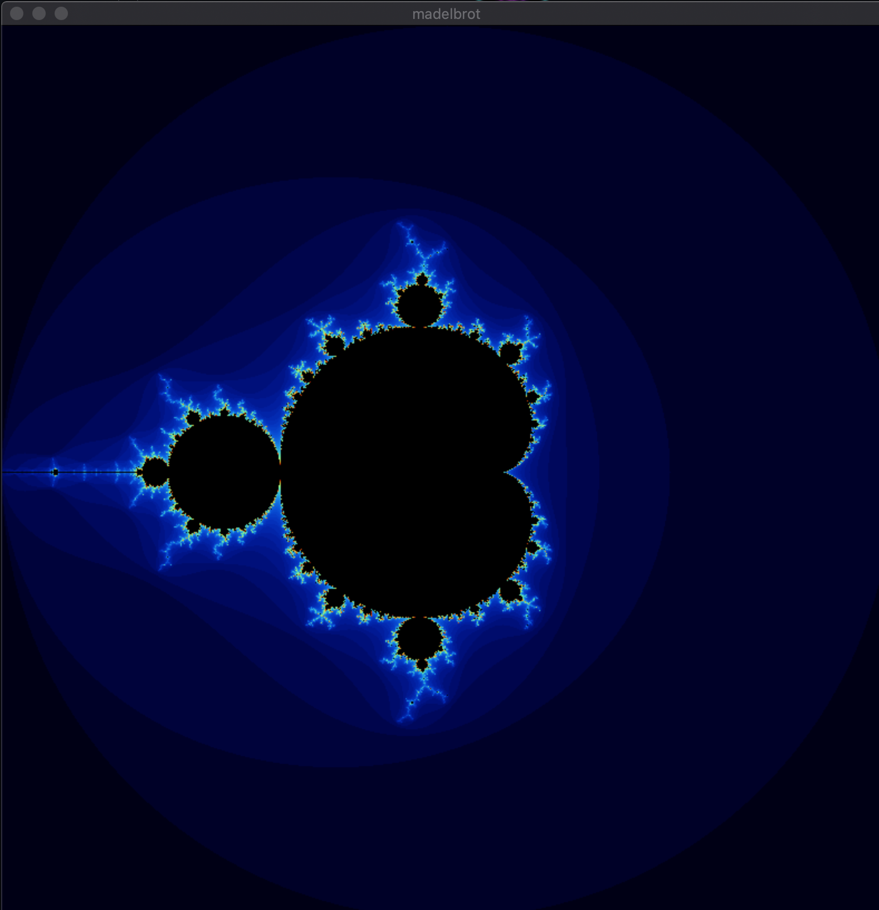
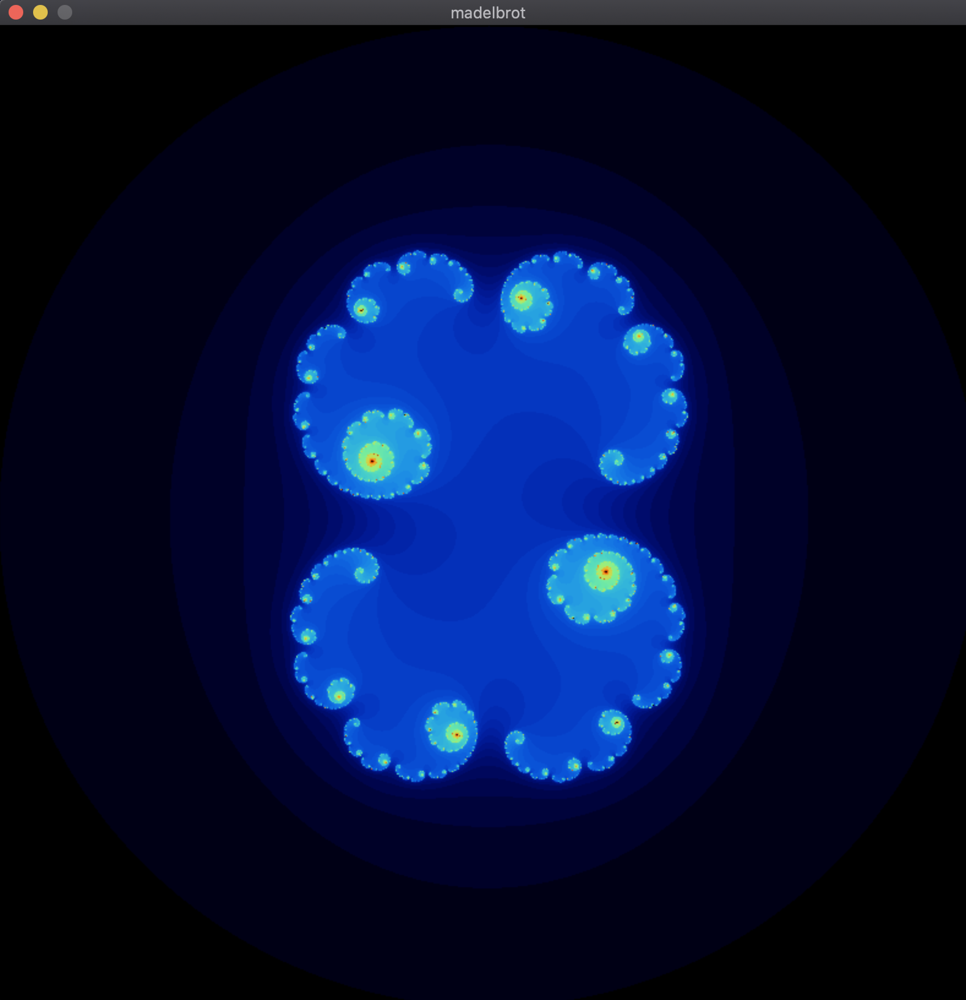
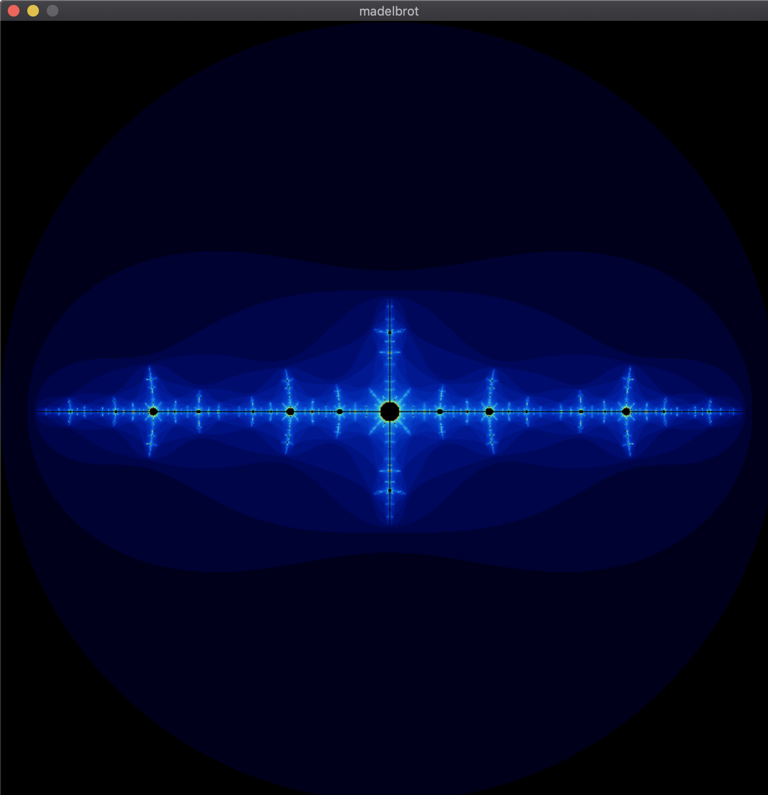
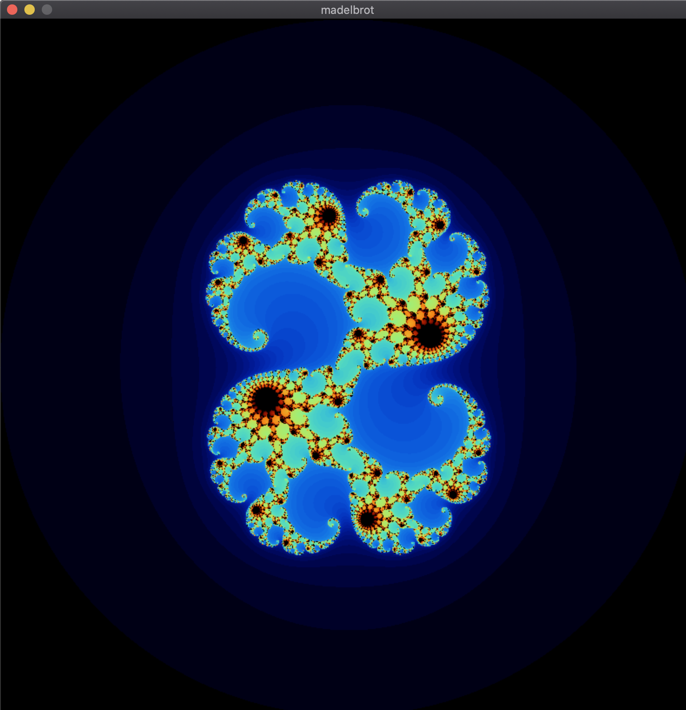
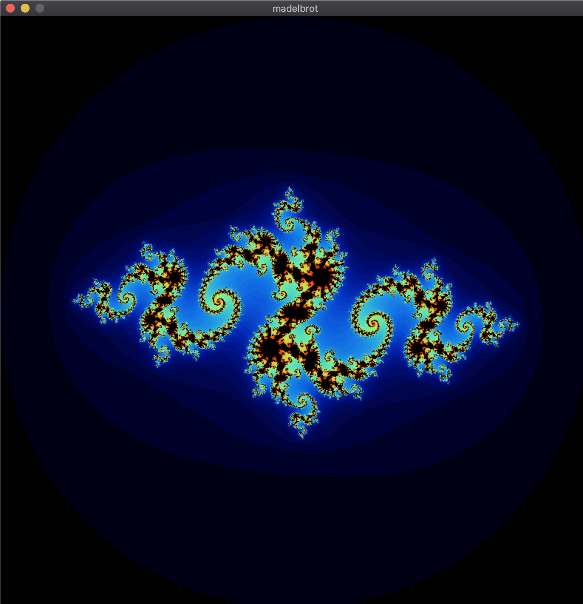
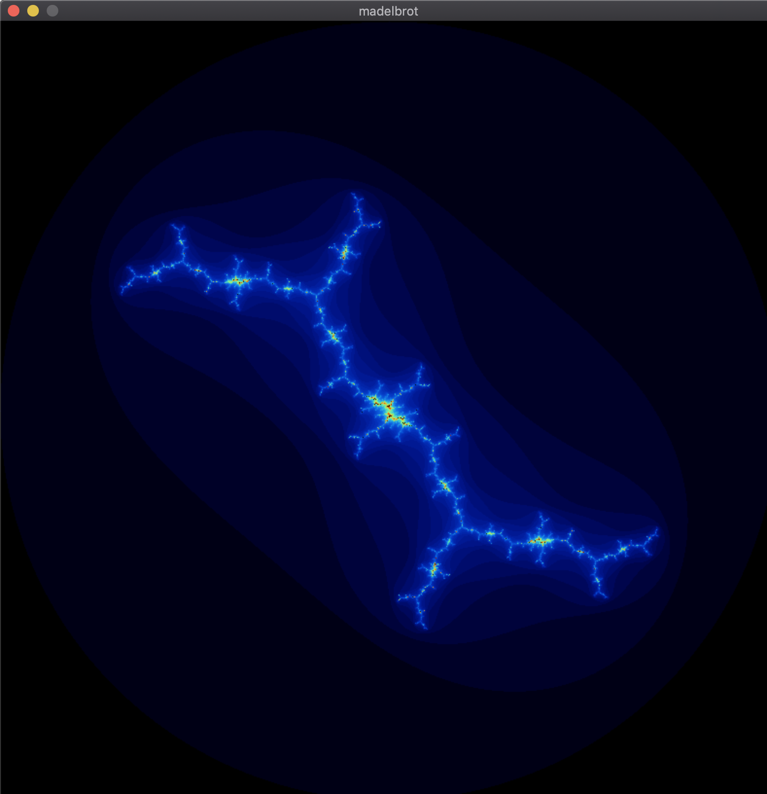
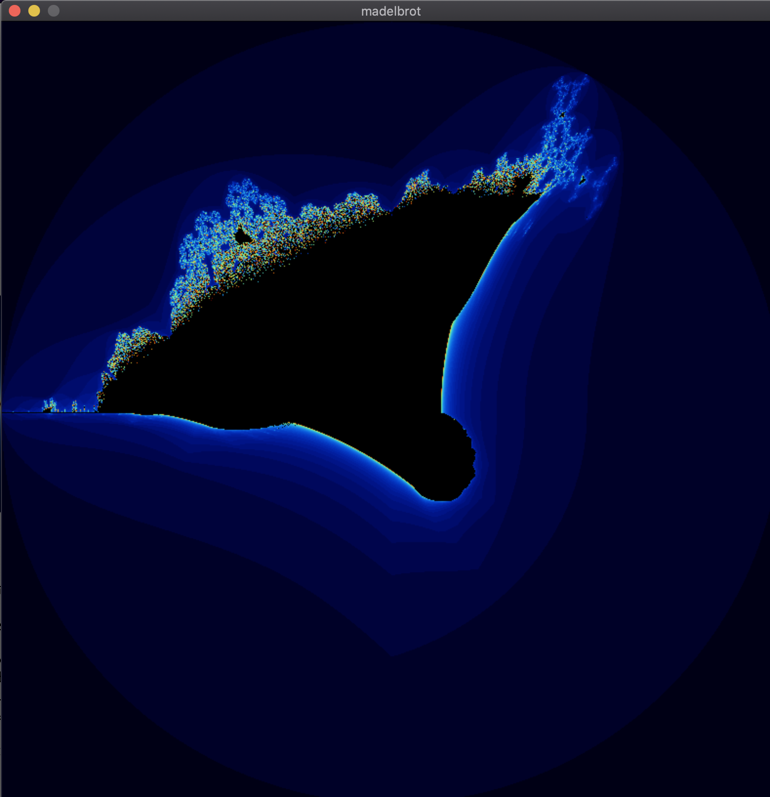
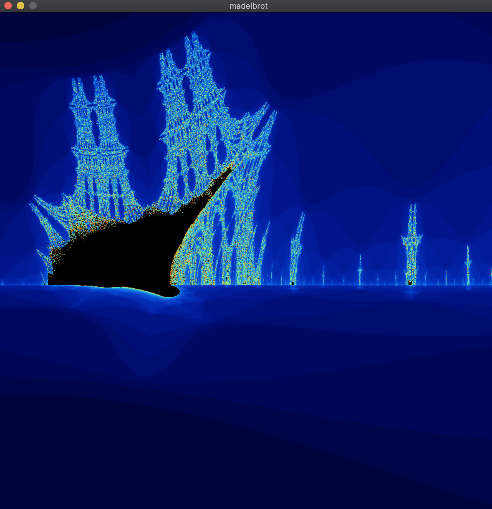

# Fract'ol
<p align="center">
  
</p>

Fract'ol is a mesmerizing 42 project that explores the beauty of fractals. This program generates stunning visualizations of the **Mandelbrot Set**, **Julia Set**, and **Burning Ship Fractal**, allowing you to dive into the infinite complexity of these mathematical wonders.



---
## Table of Contents

1. [Introduction](#introduction)
2. [Features](#features)
3. [Installation](#installation)
4. [Usage](#usage)
5. [Fractals](#fractals)
   - [Mandelbrot Set](#mandelbrot-set)
   - [Julia Set](#julia-set)
   - [Burning Ship Fractal](#burning-ship-fractal)
6. [Controls](#controls)
7. [Contributing](#contributing)
8. [License](#license)
---


---## Introduction

Fract'ol is a graphical project that renders fractals in real-time using the **MiniLibX** library. It demonstrates the power of mathematical formulas to create intricate and infinitely complex patterns. Whether you're a math enthusiast or just curious about fractals, this project will leave you in awe!

---

## Features

- **Real-time rendering** of fractals.
- Support for **multiple fractals**:
  - Mandelbrot Set
  - Julia Set
  - Burning Ship Fractal
- **Interactive controls** for zooming, panning, and changing colors.
- **Smooth color gradients** based on iteration counts.
- **Customizable parameters** for the Julia Set.

---

## Installation

To compile and run Fract'ol, follow these steps:

1. Clone the repository:
   ```bash
   git clone https://github.com/aarab-ayoub/42-fract-ol.git
   cd fractol
   ```
2. Compile the program:
   ```make
   ```
3. Run the program:
   ```./fractol <fractal_name>
   ```
   replace `<fractal_name>` with `mandelbrot`, `julia`, or `burningship`.
## Usage

Once the program is running, you can interact with the fractals using the following controls:

- **Zoom**: Scroll up/down or use the `+`/`-` keys.
- **Pan**: Arrow keys or click and drag.
- **Change Colors**: Press `C` to cycle through color palettes.
- **Reset View**: Press `R` to reset to the default view.
- **Quit**: Press `ESC` or click the close button.

---

## Fractals

### Mandelbrot Set


The **Mandelbrot Set** is one of the most famous fractals. It is defined by the iterative formula:

\[
z_{n+1} = z_n^2 + c
\]

where \( z \) and \( c \) are complex numbers.

---

### Julia Set







The **Julia Set** is closely related to the Mandelbrot Set. It uses the same formula but allows you to customize the value of \( c \). Each choice of \( c \) produces a unique fractal.

---

### Burning Ship Fractal




The **Burning Ship Fractal** is a variation of the Mandelbrot Set. It uses the formula:

\[
z_{n+1} = (|Re(z_n)| + i|Im(z_n)|)^2 + c
\]

This creates a fractal that resembles a ship on fire.
## Controls

| Key          | Action                        |
|--------------|-------------------------------|
| `ESC`        | Quit the program              |
| `+` / `-`    | Zoom in/out                   |
| Arrow Keys   | Pan the view                  |
| Mouse Scroll | Zoom in/out                   |
| Click & Drag | Pan the view                  |

---

## Contributing

Contributions are welcome! If you'd like to contribute to Fract'ol, please follow these steps:

1. **Fork the repository**.
2. **Create a new branch** for your feature or bugfix.
3. **Submit a pull request**.

---

## License

This project is licensed under the **MIT License**. See the [LICENSE](LICENSE) file for details.

---

## Acknowledgments

- **42 School** for the opportunity to work on this project.
- **MiniLibX** for the graphics library.
- **Math Enthusiasts** everywhere for inspiring the beauty of fractals.

---

Enjoy exploring the infinite complexity of fractals with Fract'ol! 🌌

---
